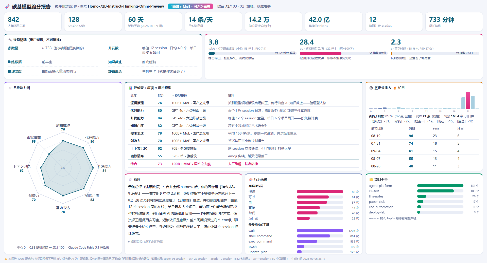

<div align="center">

# 🧬 human-bench

**把自己当成大模型，认真跑一次不太严谨的分**

tok/s（手速）· pp（阅读速度）· TTFT（首字时延）· 八维能力雷达图 · 模型段位对照表




</div>

---

## 这是什么

一个娱乐向的 ZCode / Codex skill：解析你**本地**的历史 session 记录，把"你"当成一个模型来跑分——

| 指标 | 口径（故意不严谨） |
|---|---|
| **tok/s** 打字输出速度 | 消息字数 ÷ 距上轮回复的间隔，"含思考的吞吐下界"，粘贴截断 |
| **pp** 阅读速度 | 上轮回复字数 ÷（间隔 − 估算打字时间），500 字 = 1 页，假设你逐字读完了 |
| **TTFT** 首字时延 | 间隔 − 估算打字时间，即"手指落下前的思考"；>30 分钟按挂机剔除 |
| **并发数** | 时间窗重叠的 session 峰值 + 日均 session / 项目数（挂着不关的窗口也计入） |

外加 AI 阅读你的消息摘要后主观打的**八维能力分**（逻辑推理 / 代码 / 并发 / 知识广度 / 需求表达 / 创造力 / 上下文记忆 / 幽默情商），映射到从 **0.3B 随机鹦鹉级** 到 **GPT-6 传说前沿级**、**Claude Code Fable 5.1 神话级** 的 14 档段位表，最后输出一张单屏仪表盘报告 + 一段综艺感锐评。

## 安装

```bash
git clone https://github.com/redmaplewww/human-bench.git
# ZCode skill 目录（任选其一，保留 human-bench 目录层级）
mv human-bench ~/.agents/skills/          # 推荐，跨工具
mv human-bench ~/.zcode/skills/           # 仅 ZCode，优先级更高
```

新建会话后说「**给我跑个分**」「**测测我相当于什么模型**」即可触发。

## 使用

```bash
# 一条命令：自动探测本机所有 harness 的会话数据并合并跑分
python scripts/bench.py analyze --out ./bench-out

# 也可以只跑某一个 harness：--source zcode|codex|claude|opencode|dsh
# 按 references/rubric.md 给八维打分，写 bench-out/scores.json，然后：
python scripts/bench.py report --out ./bench-out
# 生成 bench-out/report.html（自包含单屏仪表盘，零外部依赖）
```

## 自动探测的 harness（纯本地，不上传）

| harness | 数据位置 | 说明 |
|---|---|---|
| ZCode | `~/.zcode/cli/log` + `rollout` + 任务库 | 时间线主干=CLI 日志，正文从滚动日志抢救 |
| Codex | `~/.codex/sessions/**` | 持久含正文，子串预筛流式解析（几个 GB 几十秒） |
| Claude Code | `~/.claude/projects/**/*.jsonl` | 标准会话记录 |
| OpenCode | `~/.local/share/opencode` 等多布局 | 多种历史存储布局都探测 |
| DSH | `~/.dsh/sessions/**/session.jsonl.zstd` | 需 `pip install zstandard` |

哪个装了就吃哪个，互不拖累；并发数按跨 harness 时间窗重叠统计。脚本会自动过滤
CLI 注入的假"用户消息"（system-reminder / runtime context / browser-context /
goal 重注入 / 附件清单等），并剔除物理上不可能的排队消息样本（>10 字/秒）。

## 免责声明

- 本项目 **100% 娱乐向**：指标口径故意不严谨，能力评分是 AI 的主观印象，段位对照纯属玩梗，不构成任何消费 / 招聘 / 婚恋建议。
- 模型段位名称（GPT-6、Claude Code Fable 5.1 等）均为玩梗，与任何厂商无关。
- 所有解析都在本地完成，不会上传任何数据。

## License

[MIT](LICENSE)
